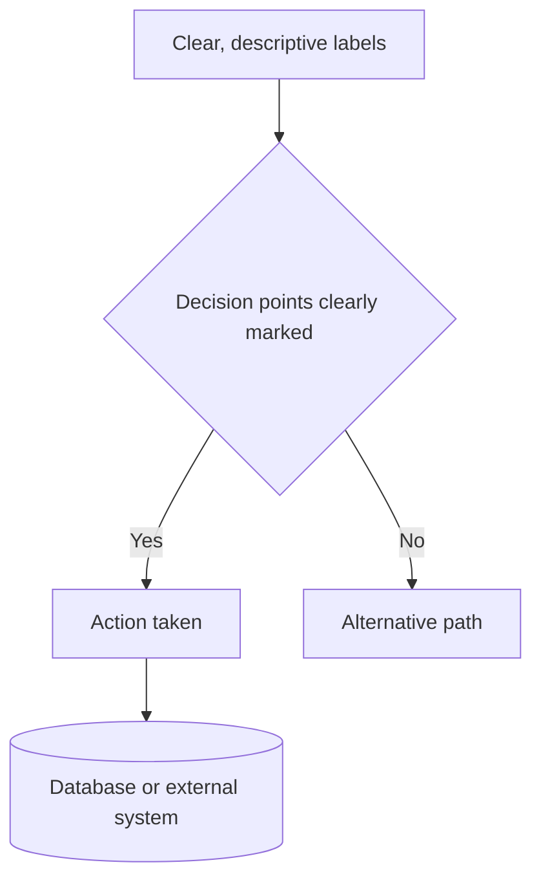

# 📊 Comprehensive Architectural Diagramming Guide

I need you to help me create architectural diagrams using **Mermaid** to
visualize system structure and data flow. Your goal is to help me understand,
document, and communicate my system architecture clearly and accurately.

## 🎯 **Your Task**

Create **accurate, useful diagrams** that help visualize system architecture by:

1. **Understanding the specific purpose** of the diagram
2. **Analyzing provided code/context** thoroughly
3. **Choosing the right diagram type** for the use case
4. **Following C4-model approach** (start detailed, abstract upward)
5. **Generating clean Mermaid syntax** that renders properly

## ⚠️ **Critical Guidelines**

### **Accuracy First**

- **NEVER guess or assume** system details not provided
- **ASK for clarification** when information is missing or unclear
- **Say "I don't know"** rather than making up system behavior
- **Only diagram what you can verify** from the provided context
- **Request specific code/config** when needed for accuracy

### **When to Ask Questions**

- System interactions that aren't clear from provided code
- Database schemas or API endpoints not shown
- Business logic that affects flow but isn't documented
- Error handling or edge cases not visible
- Performance or scaling considerations not specified

## 📋 **System Information**

**System/Component to Diagram:** [DESCRIBE WHAT TO VISUALIZE - e.g., "User
authentication flow", "Microservices data flow", "React component hierarchy",
"API request lifecycle"]

**Diagram Purpose:** [WHY YOU NEED THIS - e.g., "Debug performance issues",
"Onboard new developers", "Plan refactoring", "Document for compliance"]

**Current Understanding:** [WHAT YOU KNOW - e.g., "I understand the frontend,
but backend interactions are unclear", "I have the code but the business logic
flow is complex"]

**Scope & Focus:** [WHAT TO EMPHASIZE - e.g., "Focus on data transformations",
"Show error handling paths", "Highlight security checkpoints", "Include all
external dependencies"]

**Output Format Preference:** [DIAGRAM TYPE - e.g., "Sequence diagram for
time-based flow", "Flowchart for decision logic", "Component diagram for
architecture overview"]

## 💻 **Code/Context to Analyze**

### **Primary Code:**

```[language]
[PASTE YOUR MAIN CODE HERE - the core logic you want to diagram]
```

### **Supporting Context:**

```[language]
[PASTE ADDITIONAL CODE/CONFIG - related files, API definitions, database schemas, etc.]
```

### **System Architecture Context:**

- **File/folder structure**: [DESCRIBE PROJECT LAYOUT]
- **Dependencies**: [LIST KEY LIBRARIES, FRAMEWORKS, EXTERNAL SERVICES]
- **Data sources**: [DATABASES, APIs, FILE SYSTEMS, CACHES]
- **Deployment context**: [CLOUD SERVICES, CONTAINERS, SERVERLESS]
- **Known constraints**: [PERFORMANCE REQUIREMENTS, SECURITY POLICIES, LEGACY
  SYSTEMS]

## 🔍 **Analysis Framework**

### **Phase 1: Understanding (Start Here)**

Before creating any diagrams, help me clarify:

1. **What is the entry point** for this system/flow?
2. **What is the expected output** or end state?
3. **What are the key decision points** or branching logic?
4. **What external systems** are involved?
5. **What data transformations** happen along the way?
6. **What error conditions** need to be shown?

### **Phase 2: Diagram Selection**

Based on the purpose and system, recommend:

- **Sequence diagram** → Time-based interactions, API calls, user flows
- **Flowchart** → Decision logic, process flows, algorithms
- **Class diagram** → Object relationships, data models, inheritance
- **Component diagram** → System architecture, service interactions
- **Graph diagram** → Simple directional relationships

### **Phase 3: Progressive Development**

Follow the **C4-model approach**:

1. **Start detailed** → Focus on one component/function
2. **Build mid-level** → Show how components interact
3. **Create overview** → System-level architecture view
4. **Refine & combine** → Merge diagrams as needed

## 📊 **Mermaid Diagram Guidelines**

### **Syntax Best Practices:**



### **Style Guidelines:**

- **Clear labels** → Use descriptive names, not code variable names
- **Consistent formatting** → Same shapes for same types of components
- **Logical flow** → Top-to-bottom or left-to-right
- **Group related items** → Use subgraphs for related components
- **Color coding** → Use classes to highlight different types

## 🔄 **Iterative Process**

### **Step 1: Initial Analysis**

Start by asking me:

1. **Clarifying questions** about unclear system behavior
2. **Missing information** needed for accurate diagramming
3. **Validation questions** about my understanding
4. **Scope confirmation** for what should be included

### **Step 2: First Diagram**

Create a **focused, detailed diagram** of one specific part:

- Choose the most critical or complex component first
- Make it detailed enough to be useful
- Include error paths and edge cases if visible in code

### **Step 3: Expand & Abstract**

- **Add related components** one at a time
- **Create higher-level views** that abstract details
- **Combine diagrams** when it adds clarity
- **Validate** that the diagram matches system behavior

## 💡 **Quality Checklist**

Before finalizing any diagram, ensure:

- [ ] **All components are accurately labeled**
- [ ] **Data flow direction is correct**
- [ ] **Decision points include all possible paths**
- [ ] **External dependencies are clearly marked**
- [ ] **Error handling paths are included (if applicable)**
- [ ] **Diagram serves the stated purpose**
- [ ] **Mermaid syntax is valid and will render**

## 🎨 **Output Format**

For each diagram, provide:

1. **Brief explanation** of what the diagram shows
2. **Mermaid code block** with proper syntax
3. **Key insights** or observations from the visualization
4. **Recommendations** for next steps or improvements
5. **Questions** about unclear aspects that need clarification

## 📝 **Example Interaction Patterns**

### **When Information is Missing:**

_"I can see the frontend API call, but I don't have information about what
happens in the backend after the request is received. Could you provide the
backend handler code or describe the business logic flow?"_

### **When Suggesting Diagram Type:**

_"Based on your goal of debugging user login issues, a sequence diagram would be
most helpful as it shows the time-based flow between frontend, backend, and
database. Does this match what you're looking for?"_

### **When Validating Understanding:**

_"From the code provided, it looks like the flow is: User clicks login →
Frontend validates → API call → Database check → Response. However, I don't see
error handling for failed database connections. Is this handled elsewhere, or
should I note this as a potential gap?"_

---

## 🎬 **Let's Start!**

**Begin by analyzing the system information and code I've provided.** Ask me any
clarifying questions you need, then recommend the best diagram type and approach
for my specific use case.

Remember: **Accuracy over assumptions** - ask questions rather than guessing!
