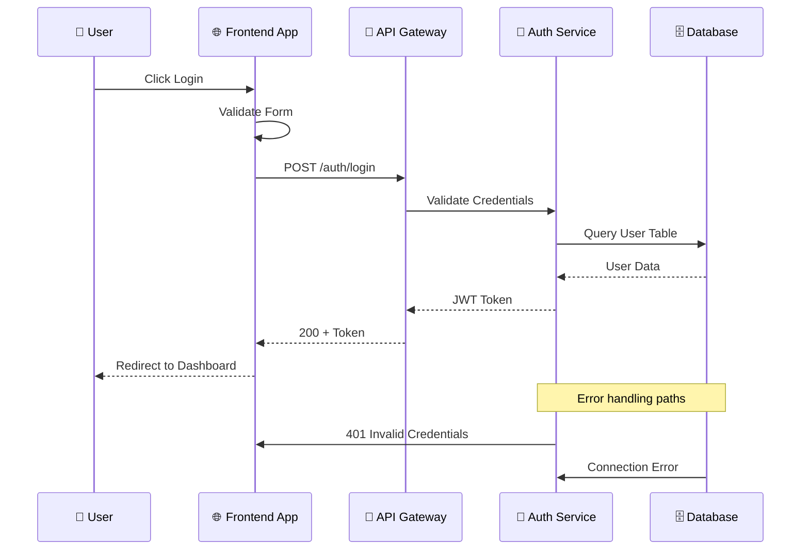
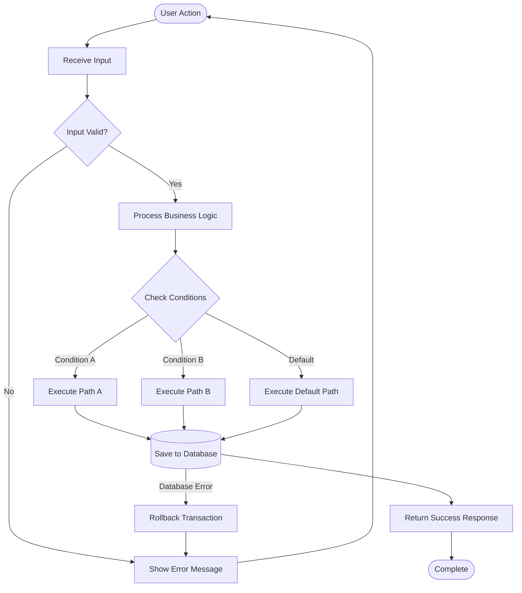
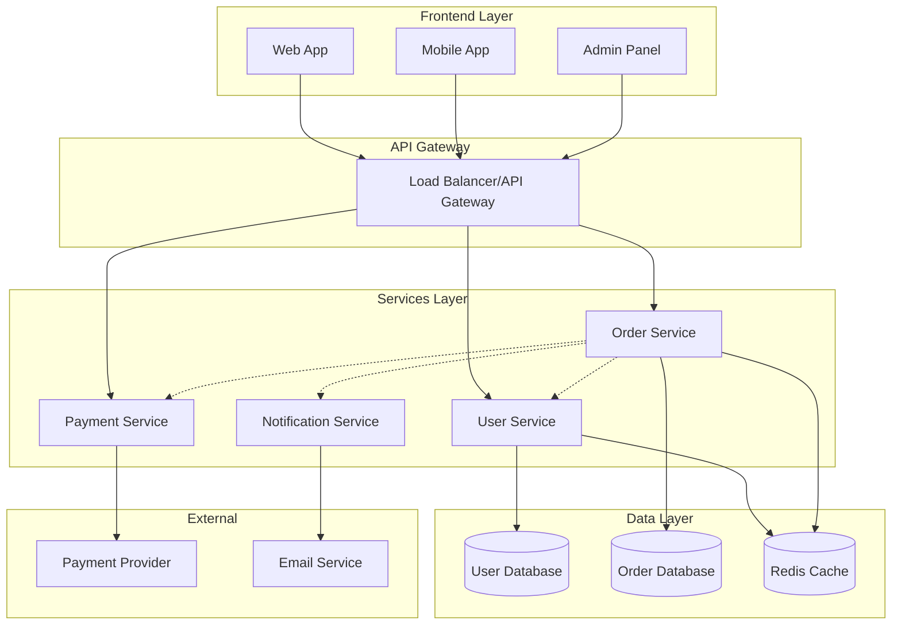
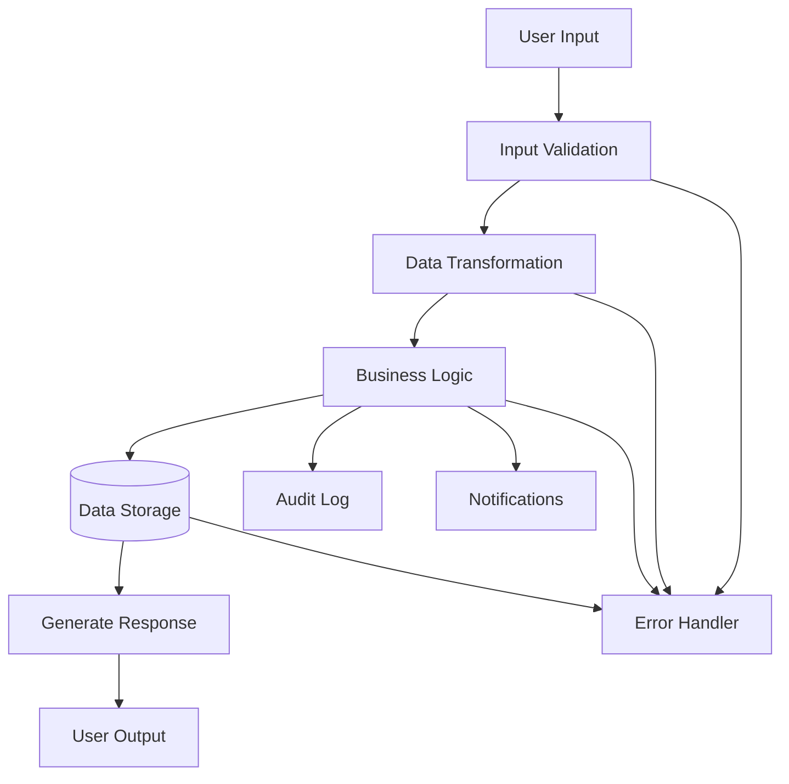
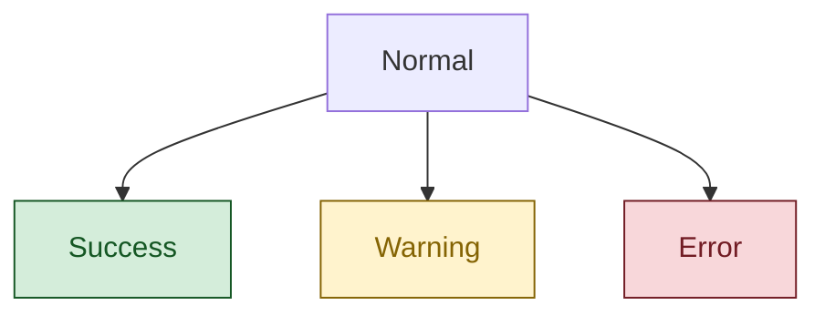
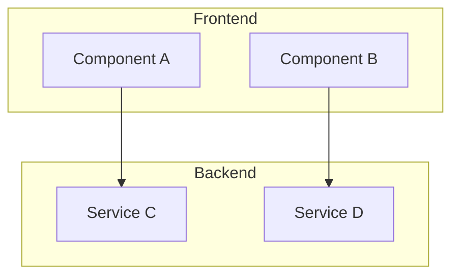

# 🔧 Mermaid Diagram Templates

Ready-to-use **Mermaid templates** for common architectural scenarios. Copy,
customize, and use these as starting points for your system diagrams.

## 🎯 **How to Use Templates**

1. **Choose the appropriate template** based on your use case
2. **Copy the Mermaid code** to your editor or Mermaid Live Editor
3. **Replace placeholder text** with your actual components/flows
4. **Customize styling** and add/remove components as needed
5. **Validate syntax** using Mermaid preview or online editor

---

## 📊 **Template Collection**

### **1. API Request Flow (Sequence Diagram)**

**Use for:** API interactions, user authentication flows, microservice
communication



**Customization:**

- Replace participant names with your actual services
- Add/remove steps based on your flow
- Include error handling paths specific to your system

---

### **2. Business Logic Flow (Flowchart)**

**Use for:** Decision trees, business process flows, algorithm visualization



**Customization:**

- Replace decision points with your business rules
- Add parallel processing paths if needed
- Include specific error handling for your domain

---

### **3. System Architecture (Component Diagram)**

**Use for:** High-level system overview, microservices architecture, service
interactions



**Customization:**

- Replace services with your actual microservices
- Add/remove data stores based on your architecture
- Include message queues, caches, or other infrastructure

---

### **4. Data Model Relationships (Class Diagram)**

**Use for:** Database schemas, object relationships, inheritance structures

```mermaid
classDiagram
    class User {
        +String id
        +String email
        +String name
        +DateTime createdAt
        +login()
        +logout()
        +updateProfile()
    }

    class Order {
        +String id
        +String userId
        +Decimal total
        +String status
        +DateTime createdAt
        +addItem()
        +removeItem()
        +calculateTotal()
    }

    class OrderItem {
        +String id
        +String orderId
        +String productId
        +Integer quantity
        +Decimal price
        +updateQuantity()
    }

    class Product {
        +String id
        +String name
        +String description
        +Decimal price
        +Integer stock
        +updateStock()
        +getDetails()
    }

    User ||--o{ Order : "places"
    Order ||--o{ OrderItem : "contains"
    Product ||--o{ OrderItem : "includes"

    class PaymentMethod {
        <<interface>>
        +processPayment()
        +refund()
    }

    class CreditCard {
        +String cardNumber
        +String expiryDate
        +processPayment()
        +refund()
    }

    class PayPal {
        +String accountEmail
        +processPayment()
        +refund()
    }

    PaymentMethod <|-- CreditCard
    PaymentMethod <|-- PayPal
    Order --> PaymentMethod : "uses"
```

**Customization:**

- Replace classes with your actual data models
- Add specific methods and properties for your domain
- Include inheritance relationships if applicable

---

### **5. Simple Data Flow (Graph)**

**Use for:** Simple directional relationships, basic system connections



**Customization:**

- Replace nodes with your actual processing steps
- Add parallel flows or alternative paths
- Include monitoring and logging components

---

## 🎨 **Styling and Customization**

### **Adding Colors and Styles**



### **Using Subgraphs for Organization**



## 💡 **Best Practices**

1. **Start simple** → Begin with basic structure, add complexity gradually
2. **Use clear labels** → Descriptive names over technical variable names
3. **Group related items** → Use subgraphs for logical organization
4. **Show data flow** → Make direction of information clear
5. **Include error paths** → Don't forget edge cases and failures
6. **Validate syntax** → Test in Mermaid Live Editor before sharing

## 🔗 **Helpful Resources**

- **Mermaid Live Editor**: [https://mermaid.live/](https://mermaid.live/)
- **Mermaid Documentation**: [https://mermaid.js.org/](https://mermaid.js.org/)
- **Syntax Reference**:
  [https://mermaid.js.org/syntax/](https://mermaid.js.org/syntax/)

---

**Choose a template that matches your use case, customize it with your specific
components, and validate the syntax before using!**
